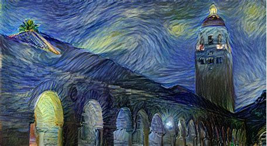
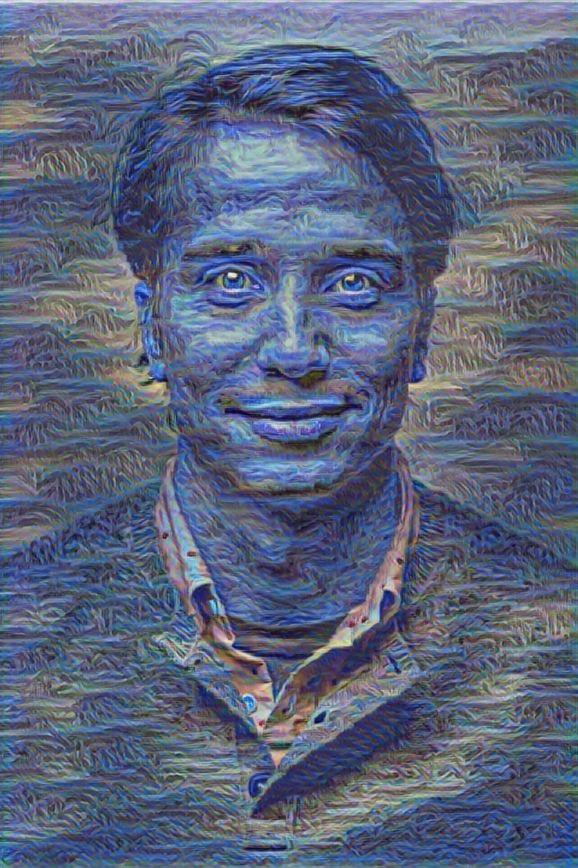
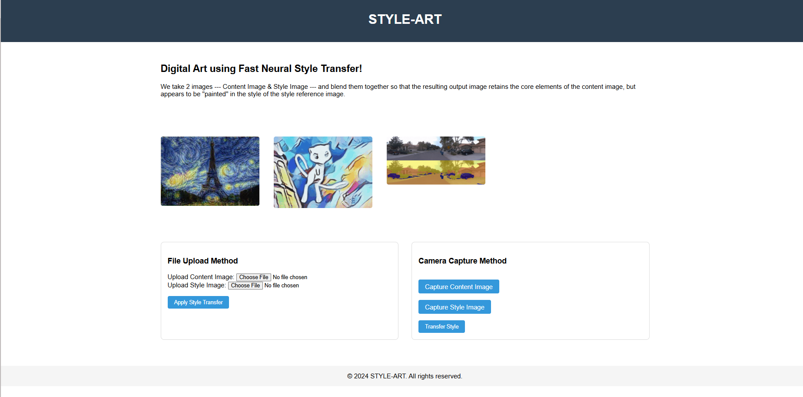
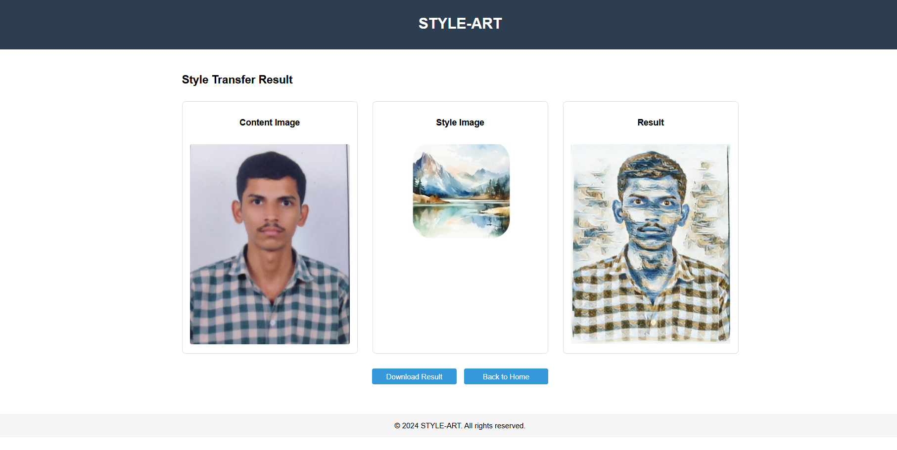

### **📌 Neural Image Style Transfer**  
🚀 *A deep learning-based implementation of Neural Style Transfer to apply artistic styles to images.*  

---

## **🖼️ Overview**  
This project implements **Neural Style Transfer (NST)** using deep learning, enabling users to apply the style of one image (artwork) to another image while preserving the original content structure. The model is based on **VGG-19**, a pre-trained convolutional neural network.

### **✨ Example Output**
                    

---

## **📌 Features**  
✅ Transfer artistic styles to images using deep learning  
✅ Uses **VGG-19** as the feature extractor  
✅ Optimized loss function with **content loss + style loss**  
✅ Customizable hyperparameters (epochs, learning rate, etc.)  
✅ Fast optimization using **Adam optimizer**  

---

## **🚀 Installation**
### **1 Clone the Repository**
```bash
git clone https://github.com/ChandraMoon88/Neural-Image-Style-Transfer.git
cd Neural-Image-Style-Transfer
```

### **2 Run the application**
```bash
python app.py
```

### **3️ Run the Style Transfer**
```bash
python style_transfer.py --content images/content.jpg --style images/style.jpg --output outputs/stylized.jpg
```

---

## **⚙️ Command-Line Arguments**
| Argument          | Description                                 | Default |
|------------------|-------------------------------------|---------|
| `--content`      | Path to the content image           | Required |
| `--style`        | Path to the style image             | Required |
| `--output`       | Path to save the stylized image     | `outputs/stylized.jpg` |
| `--epochs`       | Number of training epochs          | `100` |
| `--lr`          | Learning rate for optimization     | `0.001` |

---

## **📊 Results**

Check out this web interface for implementation of this project:


Check out this output image showing the style transfer in action:



---

## **🛠️ How It Works**
1. **Load Pre-trained VGG-19:** Extracts content and style features from intermediate layers.  
2. **Compute Content Loss:** Ensures the generated image retains the structure of the original content.  
3. **Compute Style Loss:** Matches the Gram matrices of the style image to the output image.  
4. **Optimization:** Uses **Adam optimizer** to iteratively refine the output image.

---

## **📚 References**
- Gatys, L. A., Ecker, A. S., & Bethge, M. (2015). ["A Neural Algorithm of Artistic Style"](https://arxiv.org/abs/1508.06576).
- VGG-19 Model from **torchvision.models**.

---

## **👨‍💻 Author**
Developed by **[Kuncham Chandra Shekar](https://github.com/ChandraMoon88)**  
If you found this project helpful, ⭐ **star** the repository! 😊  

---

## **📝 License**
This project is licensed under the **MIT License**. You are free to use and modify it.  

---
